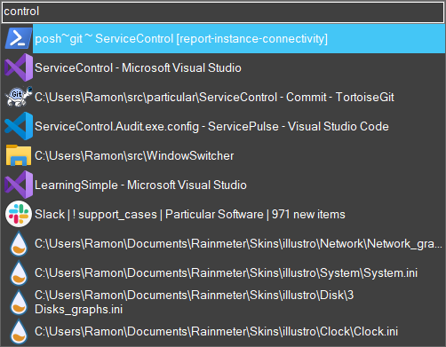

# WindowSwitcher

Binds (by default) to `CTRL+ALT+I` and allows you to enter data to open a specific window on your desktop.



##  How to use

To use this:

- Download and install [AutoHotkey](https://github.com/Lexikos/AutoHotkey_L/releases)
- Clone or download this repository
- Run (doubleclick) `WindowSwitcher.ahk` in the root
- Press `CTRL+ALT+I` to test

## How to override shortcut key

To override the shortcut key edit [WindowSwitcher.ahk](WindowSwitcher.ahk#L8) and look for setting `Key := "^!I"` and replace it with the Autohotkey expression of your liking. Read more about that here: https://www.autohotkey.com/docs/Hotkeys.htm

For example, to use the capslock key:

```ahk
Key := "Capslock"
```

NOTE: This will disable the capslock key which is likely not a bad thing anyway.
